

  <h1> School Management System User's Manual</h1>
 
  Group Members: Zaw Thu Htet, May Phyo Thu
   
  <small> 21, July, 2021</small>
  

## Table of Contents
- [Project Overview](#project-overview)
- [Custom Module Installation](#custom-module-installation)
- [Operation](#operation)
    - [Create Courses](#create-courses)
    - [Create Data](#create-data)
    - [Add Data into Sections](#add-data-into-sections)
    - [Create Attendance](#create-attendance)
    - [Request Leave](#request-leave)
    - [View Roll call Percentage](#view-roll-call-percentage)
    - [Create Exam Questions](#create-exam-questions)
    - [Test Exam and Generate Result](#test-exam-and-generate-result)
    - [Total Exam result](#test-exam-result)

## Projcet Overview
School management system is very convenient for checking students' roll-call percentage and also useful  for saving attendance records of each student and for testing exams. 
    Functions of the system:
- Manage attendance
- Test Exam

## Custom Module Installation
To run this system you need to install our custom module in odoo version 15. By clicking install button you can easily access this system.

## Operation

### Create Courses
Firstly, go to ***Course*** menu and create new course by clicking create button.

 In this form view, you can add totoal chapters of related course and can define course start-date and end-date.
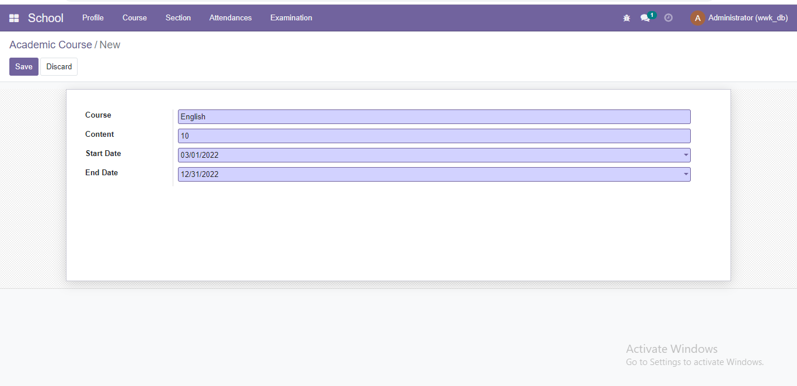

### Create Data
Click ***Profile*** menu and create new data like studens' info and teachers'info.

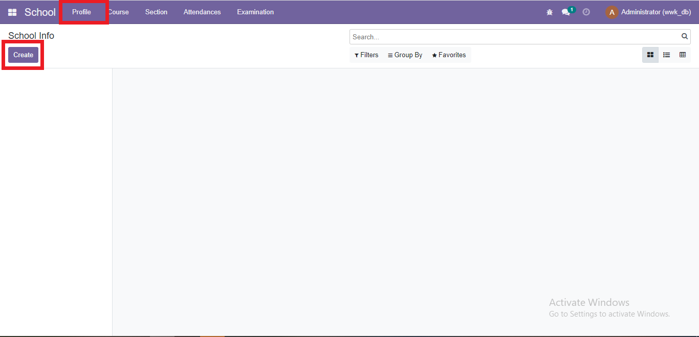

Choose role (teacher head,teacher or student), fill required informations and save by clicking save button. 

Create new Student
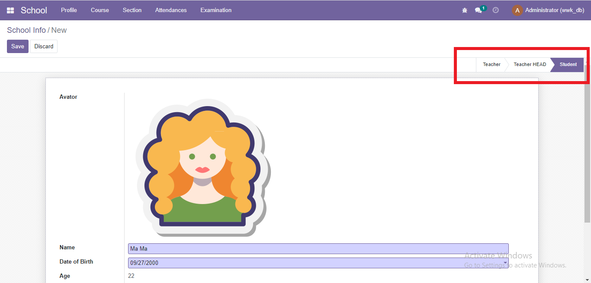
Create new Teacher
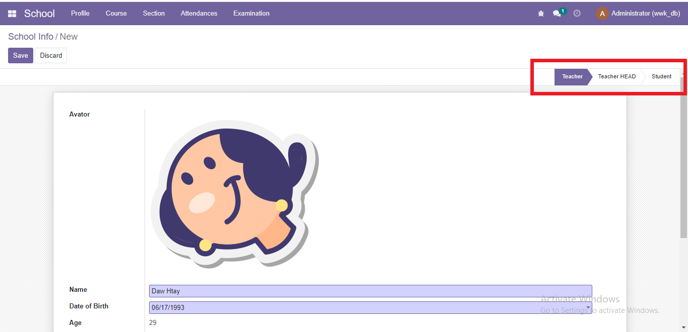
Create new Teacher Head
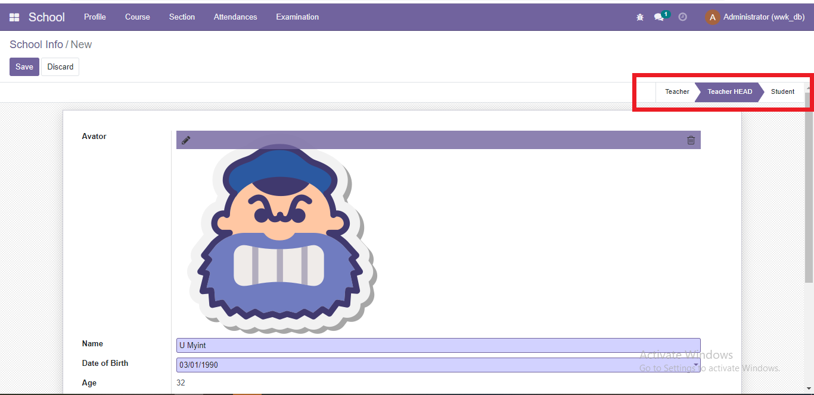

Can see same role in a collection by chosing this options
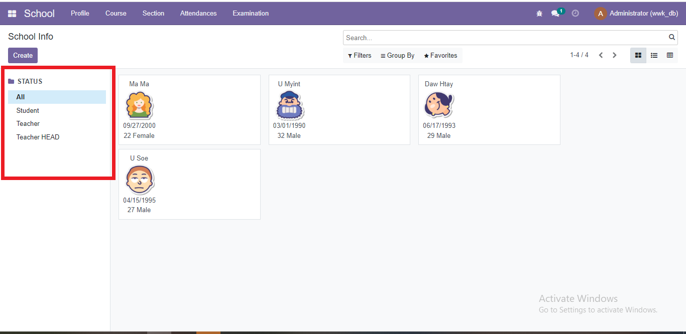

### Add Data into Sections
After creating needed data, you can add these data into sections. A section can have one teacher head, many teachers and many students. You need to define students' roll numbers and keep in mind to define like A1(Section A's roll-1), A2, B1(Section B's roll-1),B2 

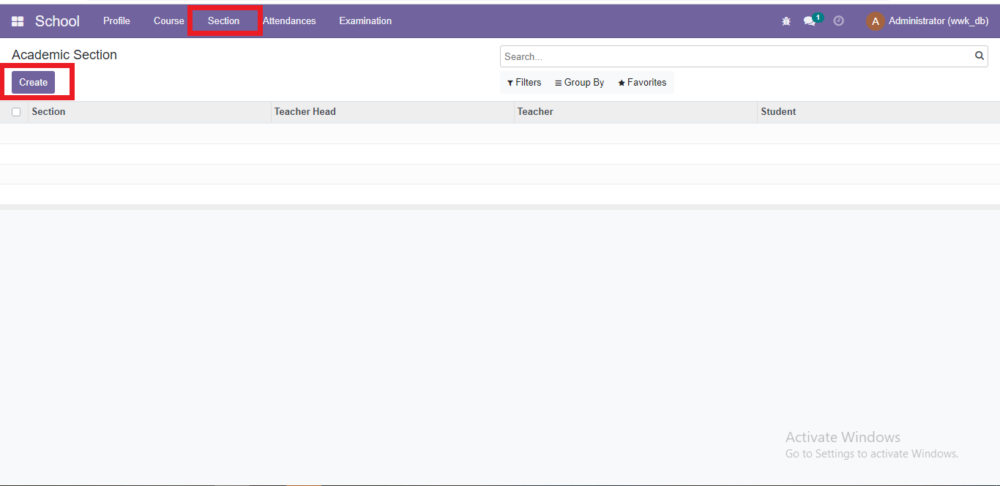
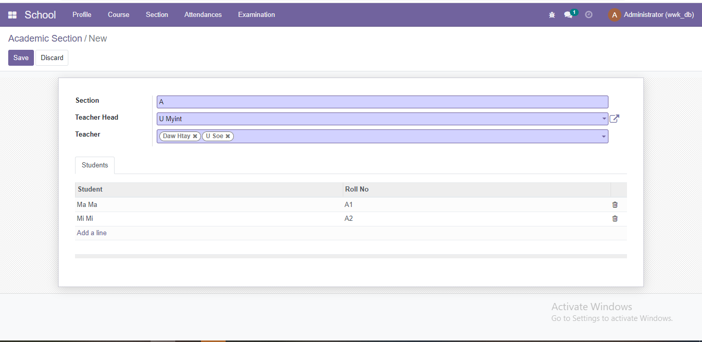

### Create Attendance
Go to Attendance > Daily Attendance menuitem and create new attendance record for each student
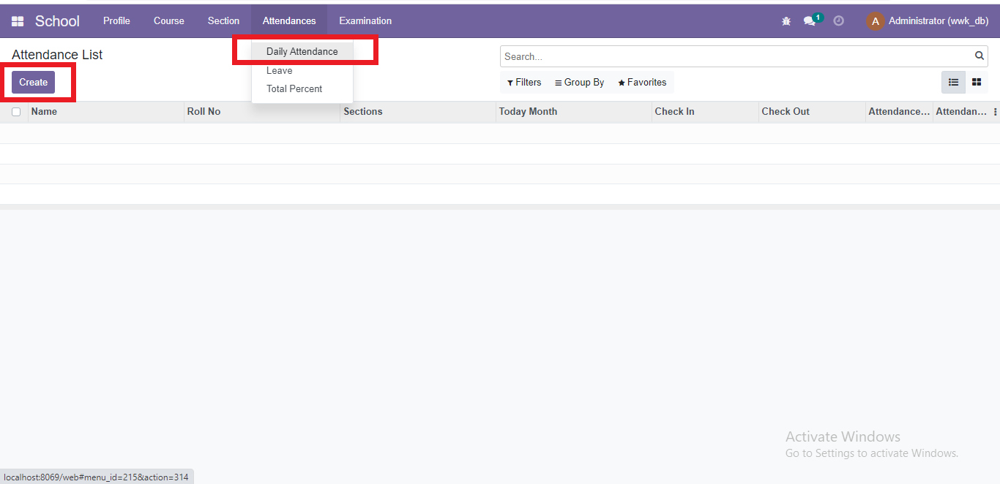
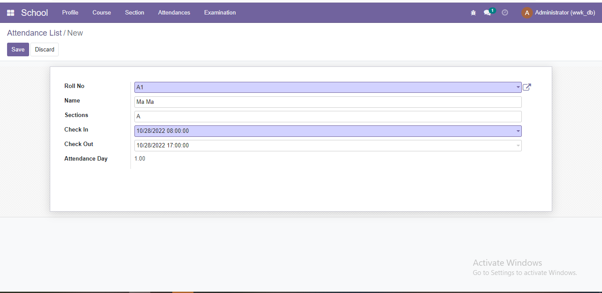

### Request Leave
To request leave go to Attendance > Leave menuitem . 
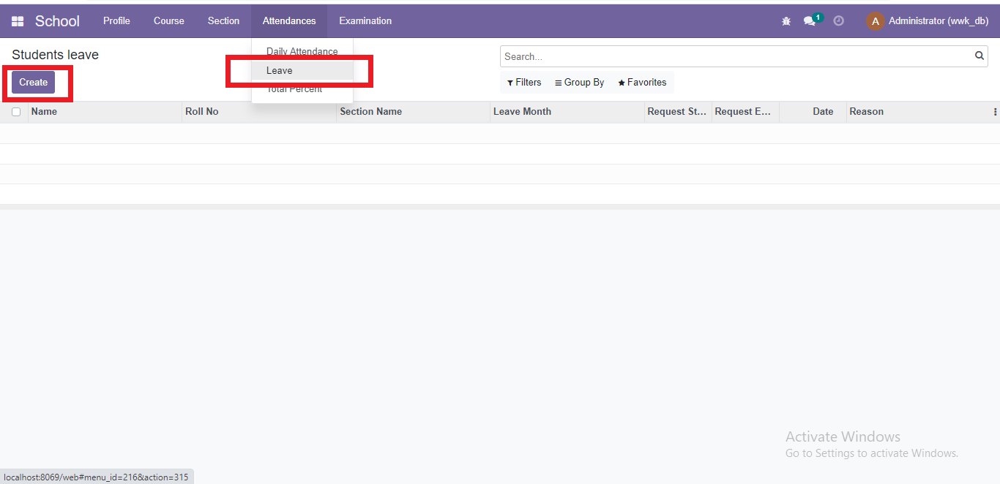
Can choose leave type and define wanted durations by selecting start date and end date.
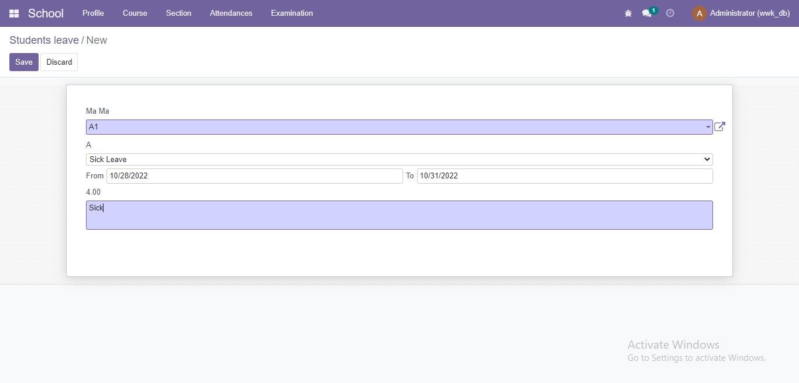

### View Roll call Percentage
To See roll call percentage of each student, go to Attendance > Total Percentage menu. 
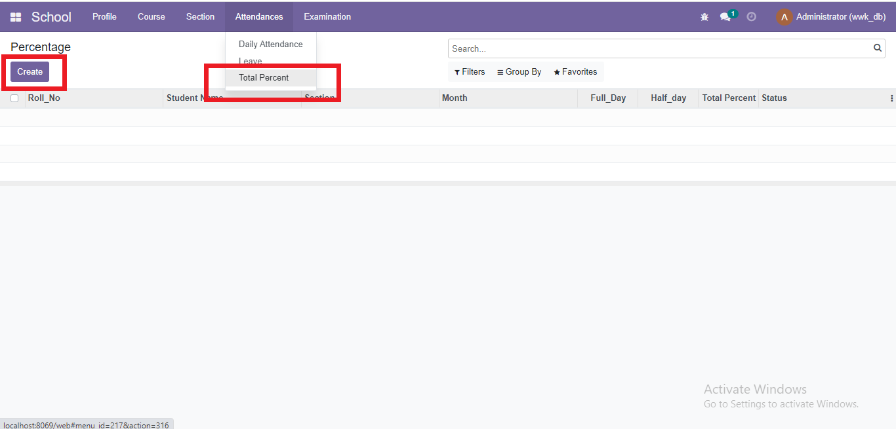
By selecting student's name and by inserting the number of month(like October as 10) you want to view ,can see that student's attendance record and roll call percent
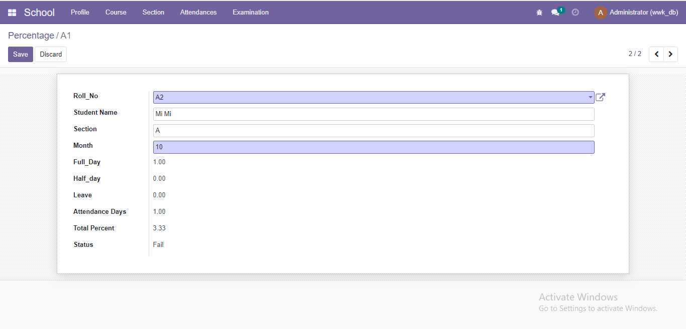

### Create Exam Questions
Go to Examination > Quizz menu, write questions and define correct answers. Can also define scores for each questions and can hide some questions that do not want to show in exam form view by removing check mark  in the active column .
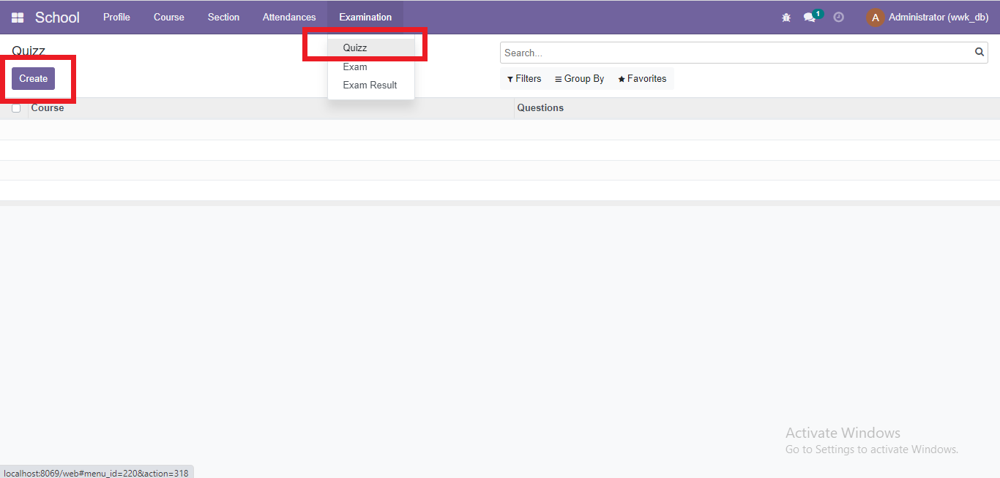
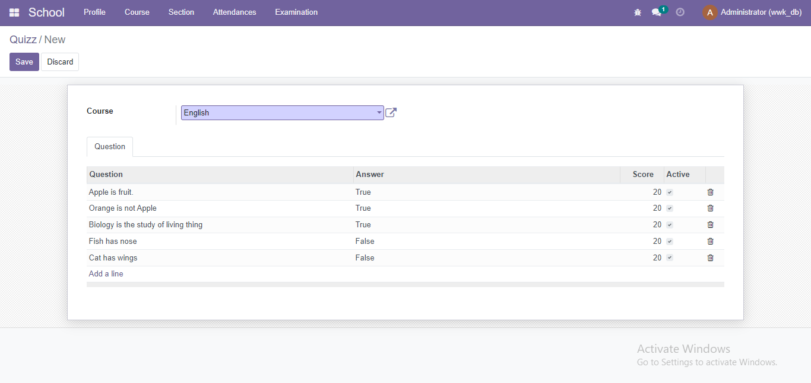
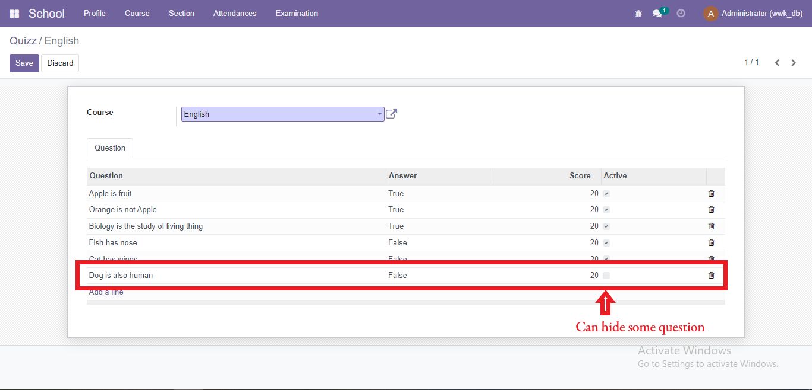

### Test Exam and Generate Result
To answer exam questions go to Examination > Exam menu. Choose course name and student whose roll-call precentage is at least 80%.
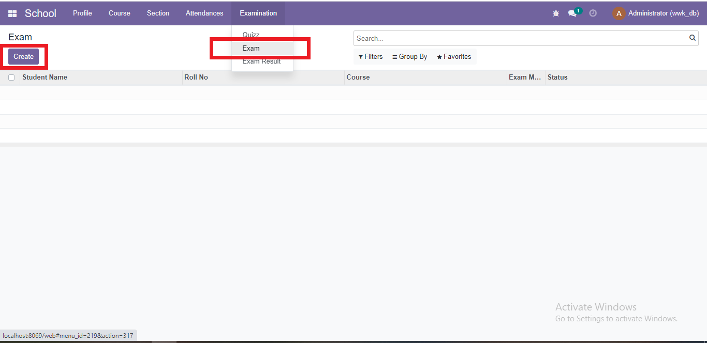

After selecting course, you can answer questions. And then, click submit button to see your result.
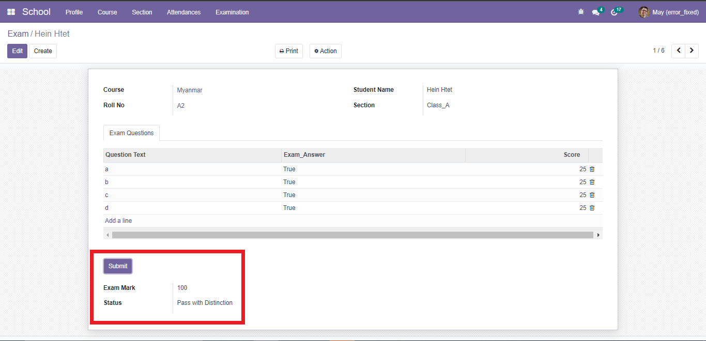

### Total Exam Result
To  view the total marks of all courses that student answered, go to Examination > Exam Result.
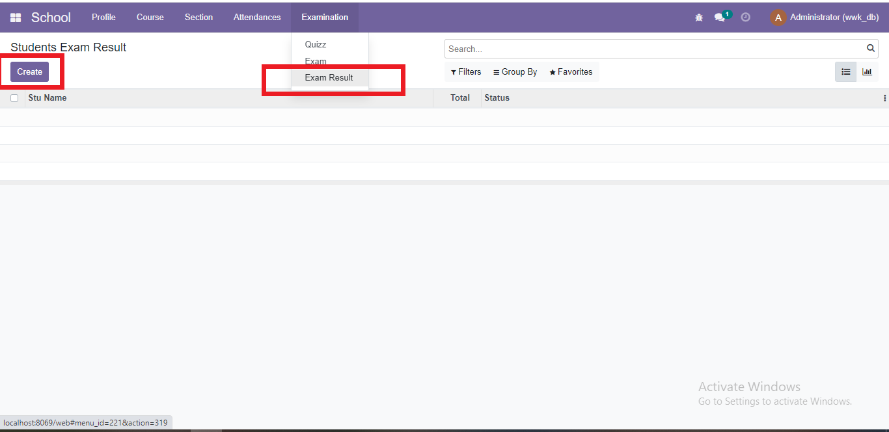
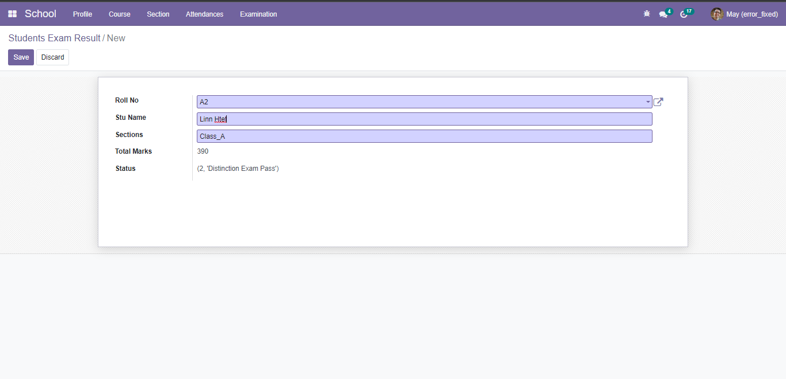